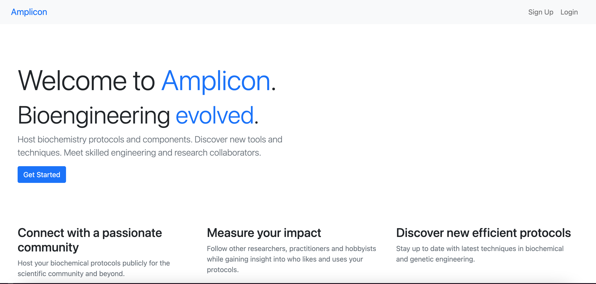

# Amplicon

Amplicon is a prototype for a GitHub like collaboration platform for biochemical researchers and developers.

The idea is to create a central hub for discovering new tools and protocols for biochemical research and engineering endeavours. Amplicon powers open collaboration and publishing of scientific protocols to accelerate research and industry efforts.

## Extension Ideas
* Amplicon Publish - Exploration portal and publishing via open access on the platform
* Amplicon x GenBank
* Amplicon x ProteinDb
* Amplicon Engineered - Genetic circuits and protein designer in application

# License
This repository is licensed under [MIT Open Source](https://opensource.org/licenses/MIT)
